# 实现一个演示版 mini 调试器

## 主要参考来源

非常感谢 [Simon Brand](https://blog.tartanllama.xyz/) 

1. [Writing a Linux Debugger](https://blog.tartanllama.xyz/writing-a-linux-debugger-setup/)

2. [CppCon 2018: Simon Brand “How C++ Debuggers Work”](https://www.youtube.com/watch?v=0DDrseUomfU&t=142s&index=6&list=LLAQvtTzLFGpCzBs2Ga8hGmw)

## 前言

### 我们学习这节课的目的

1. **消除神秘感！克服恐惧心！**

2. 学习调试器基本运行原理。

3. 了解周边涉及知识。

### 为什么需要调试器


[Bug 为什么不能彻底消除？](https://www.zhihu.com/question/38378942)

### 什么是调试器

A debugger is an application which is used to test and debug other applications.

调试器是用来**测试**及**调试**其他程序的一类**程序应用**。

### 常见的调试器

1. [Visual Stdio 调试器](https://docs.microsoft.com/en-us/visualstudio/debugger/debugger-feature-tour?view=vs-2017)

    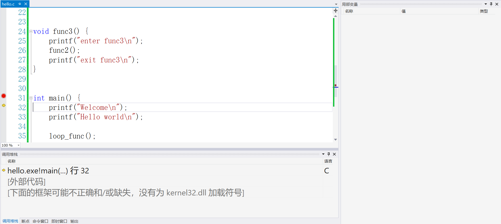

2. [gdb](https://www.gnu.org/s/gdb)

    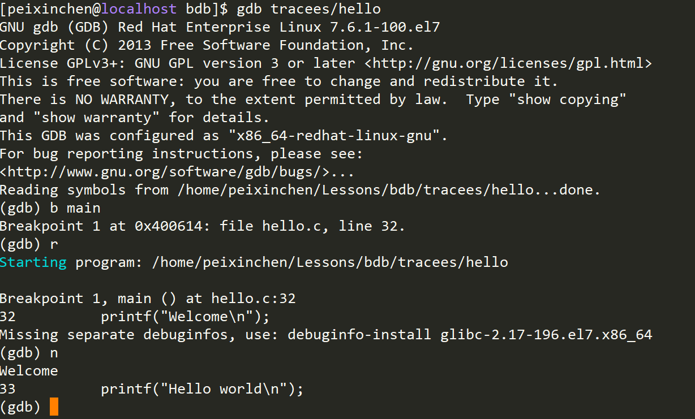

3. [lldb](https://lldb.llvm.org)

    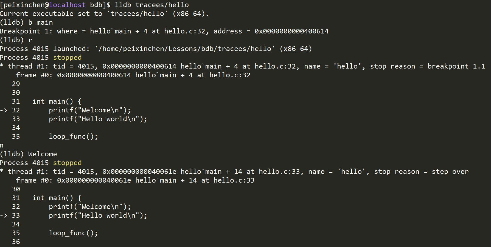

## 前置知识

### 讲解过程中演示的被调试程序源码

hello.c

```c
#include <stdio.h>

void loop_func() {
    for (int i = 0; i < 10; i++) {
        printf("%d\n", i);
    }
}

void func1() {
    printf("enter func1\n");
    printf("exit func1\n");
}

void func2() {
    printf("enter func2\n");
    func1();
    printf("exit func2\n");
}

void func3() {
    printf("enter func3\n");
    func2();
    printf("exit func3\n");
}

int main() {
    printf("Welcome\n");
    printf("Hello world\n");

    loop_func();

    func3();

    printf("Bye\n");
}
```

### 运行环境

1. [x86-64](https://www.intel.cn/content/www/cn/zh/architecture-and-technology/64-ia-32-architectures-software-developer-manual-325462.html)

2. [Linux](https://github.com/torvalds/linux)

3. [System V ABI](https://www.uclibc.org/docs/psABI-x86_64.pdf)

4. [ELF](http://refspecs.linuxbase.org/elf/elf.pdf)

5. [DWARF](http://www.dwarfstd.org/doc/Debugging%20using%20DWARF-2012.pdf)

6. [ptrace](http://man7.org/linux/man-pages/man2/ptrace.2.html)

### ptrace

**主要是操作系统（OS）提供的内核和用户态通信的接口。**

The  ptrace() system call provides a means by which one process (the "tracer") may observe and control the execution of another process (the "tracee"), and examine and change the tracee's memory and registers.  It is  primarily used to implement breakpoint debugging and system call tracing.

ptrace() 系统调用提供了一个方法，允许一个进程（作为 tracer）可以监视并控制另外的进程（作为 tracee）的执行过程，并且能检查或改变 tracee 的内存及寄存器内容。它主要用于实现断点（breakpoint）调试及系统调用跟踪。

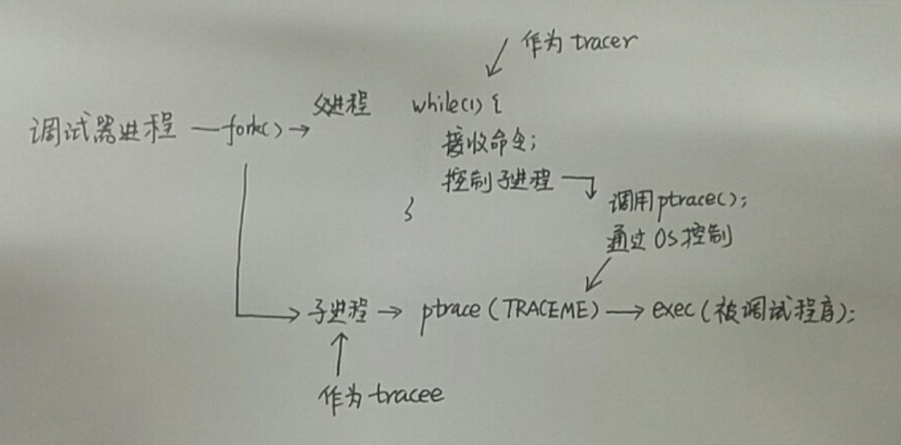

While  being  traced,  the tracee will stop each time a signal is delivered, even if the signal is being ignored. (An exception is SIGKILL, which has its usual effect.)  The tracer will be notified at its  next  call  to  waitpid(2)  (or  one of the related "wait" system calls); that call will return a status value containing information that indicates the cause of the stop in the tracee.  While the tracee is stopped,  the  tracer  can  use  various ptrace  requests  to  inspect  and  modify the tracee.  The tracer then causes the tracee to continue, optionally ignoring the delivered signal (or even delivering a different signal instead).

当被 trace 时，每次一个信号递达，tracee 都会停止运行，甚至被 tracee 明确为 ignored 的信号。（SIGKILL 是个例外。）tracer 在下一次调用 waitpid（或者相关的 “wait” 系列系统调用）时被通知；waitpid 返回的 status 值包含了使得 tracee 停止的信号的相关信息。当 tracee 停止时，tracer 可以利用 ptrace 发起多种不同的请求来监视或者修改 tracee。tracer 然后可以让 tracee 忽略或者继续递达信号（甚至可以递达不同的信号来代替）后继续运行。


If the PTRACE_O_TRACEEXEC option is not in effect, all successful calls to execve(2) by the traced  process  will cause  it  to  be sent a SIGTRAP signal, giving the parent a chance to gain control before the new program begins execution.

如果 PTRACE_O_TRACEEXEC 选项没有生效，tracee 成功执行的所有 execve 系列系统调用都会导致一个 SIGTRAP 信号发送给它，使 tracer 有机会在新程序开始运行之前就能获取控制权。

```
Signal       Value     Action   Comment
────────────────────────────────────────────────────────────────────
SIGTRAP        5        Core    Trace/breakpoint trap
```

#### 用到 ptrace 的一些常见命令行工具

1. [strace](http://man7.org/linux/man-pages/man1/strace.1.html)  用于跟踪进程执行过程中的系统调用。

2. [ltrace](https://linux.die.net/man/1/ltrace)  用于跟踪进程执行过程中的库函数调用。

#### ptrace 函数接口简介

```C
#include <sys/ptrace.h>

long ptrace(enum __ptrace_request request, pid_t pid,
            void *addr, void *data);
```

| 形参 | 作用描述 |
|-----|------|
| request | 一组枚举，用于标识不同的请求，我们用到的几个请求，见下面详解。 |
| pid | 如果调用者（caller）是 tracer，为 tracee 的 pid；否则传入 0 即可。 |
| addr | 不同的请求有不同的解释。 |
| data | 不同的请求有不同的解释。 |

#### 我们主要用到的请求

##### tracee 调用
| request | 说明 |
|--|--|
| PTRACE_TRACEME | 标记该进程会被其父进程 trace。|

##### tracer 调用
| request | 说明 |
|--|--|
| PTRACE_CONT | 让被中止的 tracer 继续运行，data表示给 tracee 的信号，0 表示没有。 |
| PTRACE_PEEKDATA | 从内存的 addr 地址处获取 64 Bit 长度的内容。|
| PTRACE_POKEDATA | 将 长度为 64 Bit 的 data 数据放置到内存的 addr 地址处。|
| PTRACE_GETREGS | 获取所有寄存器信息，data 为 struct user_regs_struct 变量的地址。|
| PTRACE_SETREGS | 设置所有寄存器信息，data 为 struct user_regs_struct 变量的地址。|
| PTRACE_GETSIGINFO | 获取发送到 tracer 的 signal 信息，data 为 struct siginfo_t 变量的地址。|
| PTRACE_SINGLESTEP | 单步执行下一条指令（机器码级别）。|

### ABI

[ABI](https://en.wikipedia.org/wiki/Application_binary_interface) 为 Application Binary Interface 的缩写，是一套**二进制规范**。

In computer software, an application binary interface (ABI) is an interface between two binary program modules; often, one of these modules is a library or operating system facility, and the other is a program that is being run by a user.

An ABI defines how data structures or computational routines are accessed in machine code, which is a low-level, hardware-dependent format; in contrast, an API defines this access in source code, which is a relatively high-level, relatively hardware-independent, often human-readable format. A common aspect of an ABI is the calling convention, which determines how data is provided as input to or read as output from computational routines; examples are the x86 calling conventions.

Adhering to an ABI (which may or may not be officially standardized) is usually the job of a compiler, operating system, or library author; however, an application programmer may have to deal with an ABI directly when writing a program in a mix of programming languages, which can be achieved by using foreign function calls.

在计算机软件领域，ABI 是用于两个二进制程序模块之间的接口；通常来说，其中一个二进制模块是库或者操作系统组件，而另一个是用户运行的程序。

ABI 定义了机器码（machine code）如何存取数据结构及运算程序，这是一种低级别的、硬件相关的格式；与之相对的，API（Application Programming Interface）定义的是源码级别的接口，相对来说更高级别、更机器不相关，并且通常是人类更可读的格式。一个通常的 ABI 形式是调用规范，决定了调用过程中输入值和输出值应该如何提供给运算程序；例如 x86 的调用规范。

遵循 ABI（无论是否官方标准）通常来说是编译器、操作系统或者库的实现者的工作；但一个应用程序的编写者在进行多编程语言的混合编程时也可能要直接处理 ABI，以使得跨语言的函数调用可以完成。

ABIs cover details such as:
...
and in the case of a complete operating system ABI, the binary format of object files, program libraries and so on.

ABI 需要包含：
...
作为操作系统的系统 ABI，object 文件和程序库的二进制格式等等。

### Executable and Linking Format (ELF)

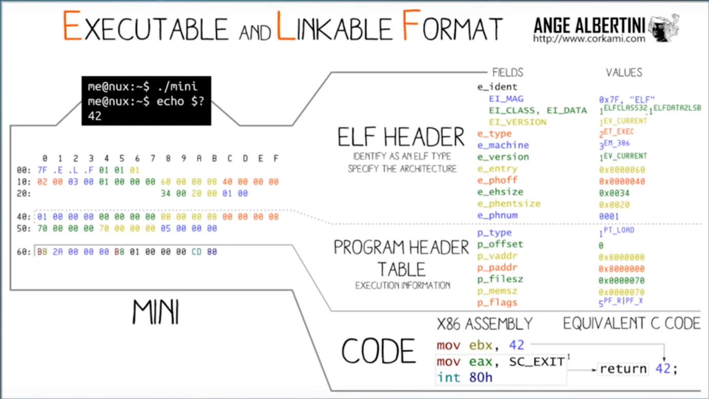

There are three main types of object files.

+ A relocatable file holds code and data suitable for linking with other object files to create an
executable or a shared object file.
+ An executable file holds a program suitable for execution.
+ A shared object file holds code and data suitable for linking in two contexts. First, the link
editor may process it with other relocatable and shared object files to create another object file.
Second, the dynamic linker combines it with an executable file and other shared objects to
create a process image. 

有三种主要的 object file。
+ Relocatable file 也就是我们编译出的 *.o 文件。
+ Executable file 也就是我们编译出的可执行文件。
+ Shared object file 也就是我们编译出的动态库文件。

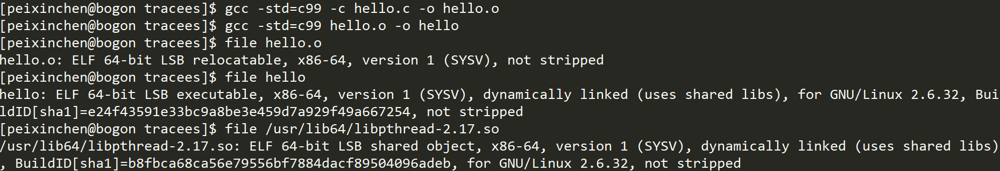

#### Object File Format

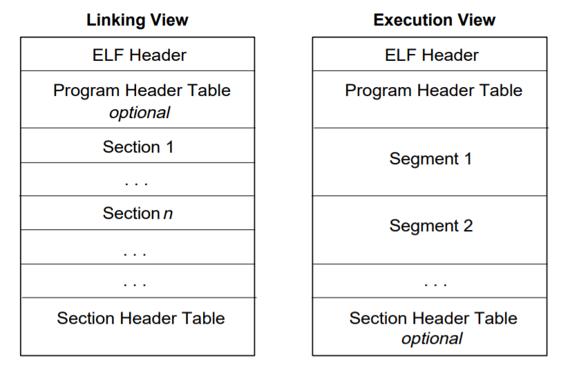

#### 读取 ELF 内容的常见命令

1. [readelf](http://man7.org/linux/man-pages/man1/readelf.1.html)   显示 ELF 文件的信息。

    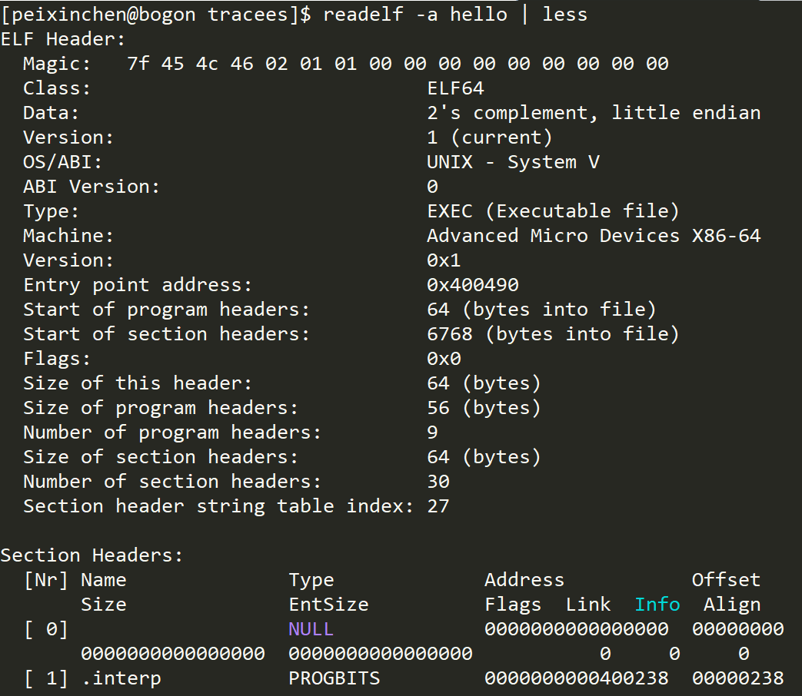

2. [objdump](http://man7.org/linux/man-pages/man1/objdump.1.html)   显示 object file 的信息。

    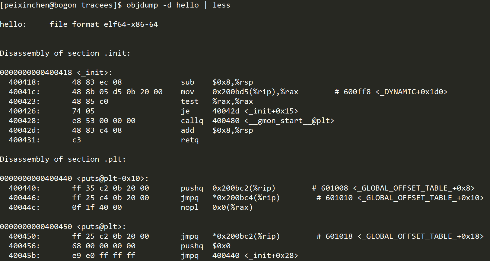

### DWARF

安装 [dwarfdump](https://www.manpagez.com/man/1/dwarfdump) 命令

```bash
// 以 root 用户运行
# yum install libdwarf-tools
```

运行 dwarfdump 查看 DWARF 信息

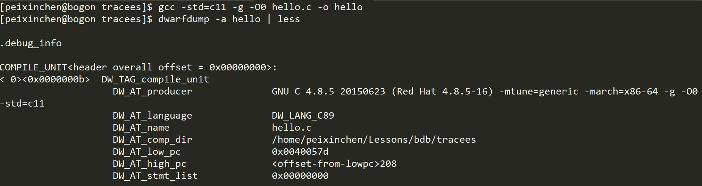

主要关注

+ .debug_info The core DWARF data containing DWARF Information Entries (DIEs)

+ .debug_line Line Number Program

#### 使用第三方库解析 DWARF 信息

1. [libelfin](https://github.com/TartanLlama/libelfin/tree/fbreg)       我们使用这个第三方库，需要切换到 fbreg 分支

2. [libdwarf](http://wiki.dwarfstd.org/index.php?title=Libdwarf_And_Dwarfdump)

### 寄存器信息（我们只关注通用寄存器）

/usr/include/sys/user.h

```c
struct user_regs_struct
{
  __extension__ unsigned long long int r15;
  __extension__ unsigned long long int r14;
  __extension__ unsigned long long int r13;
  __extension__ unsigned long long int r12;
  __extension__ unsigned long long int rbp;
  __extension__ unsigned long long int rbx;
  __extension__ unsigned long long int r11;
  __extension__ unsigned long long int r10;
  __extension__ unsigned long long int r9;
  __extension__ unsigned long long int r8;
  __extension__ unsigned long long int rax;
  __extension__ unsigned long long int rcx;
  __extension__ unsigned long long int rdx;
  __extension__ unsigned long long int rsi;
  __extension__ unsigned long long int rdi;
  __extension__ unsigned long long int orig_rax;
  __extension__ unsigned long long int rip;
  __extension__ unsigned long long int cs;
  __extension__ unsigned long long int eflags;
  __extension__ unsigned long long int rsp;
  __extension__ unsigned long long int ss;
  __extension__ unsigned long long int fs_base;
  __extension__ unsigned long long int gs_base;
  __extension__ unsigned long long int ds;
  __extension__ unsigned long long int es;
  __extension__ unsigned long long int fs;
  __extension__ unsigned long long int gs;
};
```

我们重点关注两个寄存器:

1. rip 即 [PC（程序计数器）](https://zh.wikipedia.org/wiki/%E7%A8%8B%E5%BC%8F%E8%A8%88%E6%95%B8%E5%99%A8)，用来保存计算机执行到机器码地址。

2. rbp 即 [栈帧寄存器](https://en.wikipedia.org/wiki/Call_stack#Stack_and_frame_pointers) 用来记录调用栈相关信息。

    

寄存器的进一步信息，有兴趣的同学可以查询 Intel 手册了解。

### 调试器主要功能

1. 断点（breakpoint）

2. 单步执行（next、step、stepi）

3. 显示相关代码（list）

3. 变量（print）

4. 查看调用栈信息（backtrace）

我们本项目的主要目的是实现 1、2 和 3。

### 断点

x86-64 有两种不同的断点：

1. 硬件支持

    硬件提供了一组专用寄存器用于这个用途，这个不是我们目前的重点。

2. 软件实现

    

#### 断点实现的小实验

```bash
$ objdump -d hello
```

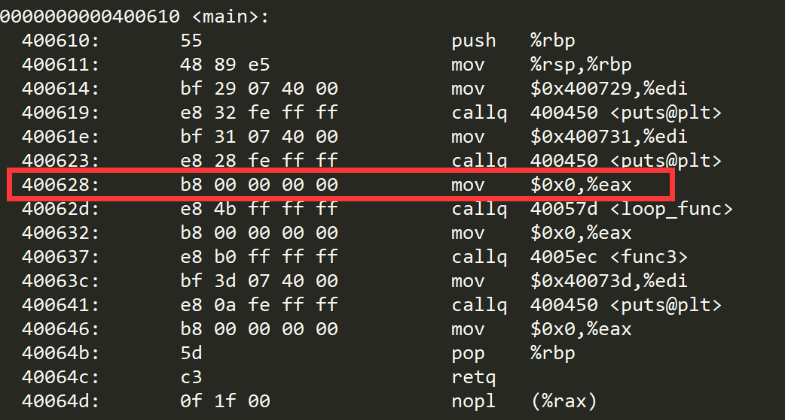

```bash
// 用二进制模式打开 hello
$ vim -b hello
```

并且用 vim 的二进制转换工具将显示形式转换成二进制显示

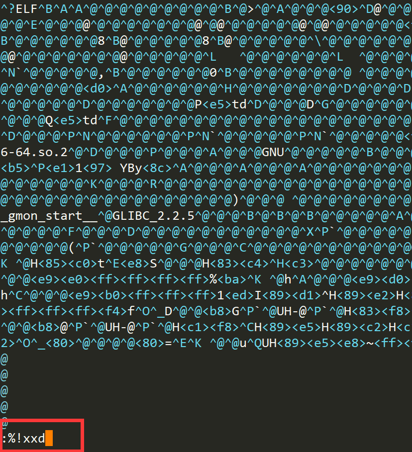

结果

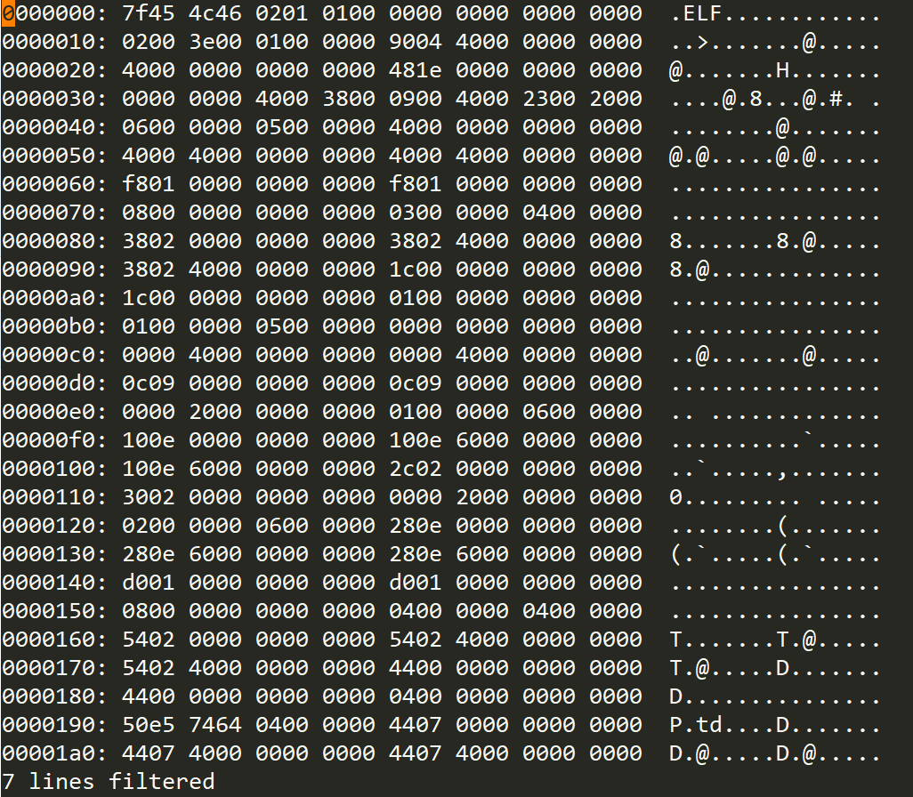

找到合适的位置并且修改指令为 0xcc

然后执行 % !xxd -r 后保存文件

执行修改后的 hello

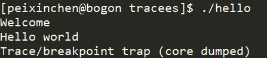

## 项目整体结构说明

### 开发环境

1. c++ 11

2. CentOS 7

3. g++ / gcc

### 架构思路


### 代码目录结构

```
.
├── ext         防止第三方库的目录
├── include
│   ├── breakpoint.hh       断点类
│   ├── command.hh          命令基类
│   ├── commands            所有命令
│   │   ├── abs_single_step.hh      next 和 step 的基类
│   │   ├── break.hh                打断点
│   │   ├── continue.hh             继续执行
│   │   ├── list.hh                 打印代码
│   │   ├── next.hh                 单步执行（不进函数）
│   │   ├── run.hh                  启动运行
│   │   └── step.hh                 单步执行（进函数）
│   ├── debugger.hh         调试器
│   ├── exception.hh        所有异常
│   ├── inferior.hh         关系 tracee 的类（名字参考自 gdb）  
│   ├── ptrace_proxy.hh     所有 ptrace 调用的封装
│   └── string_utils.hh     处理一些字符串的常用函数
├── LICENSE     项目协议
├── Makefile    构建 Makefile
├── src
│   └── main.cc 主程序入口
└── tracees     被调试程序
    ├── hello.c
    └── Makefile
```

## 实现

### 命令处理轮询

[参考代码](https://github.com/peixinchen/bdb/tree/step-1)

### 第一个命令 run

利用 fork + exec 开始启动 tracee

加入了对启动命令添加选项的支持

[参考代码](https://github.com/peixinchen/bdb/tree/step-2)

### 第一个断点

我们先直接利用地址打断点

[参考代码](https://github.com/peixinchen/bdb/tree/step-3)

```bash
$ objdump -d tracees/hello
...
0000000000400610 <main>:
  400610:       55                      push   %rbp
  400611:       48 89 e5                mov    %rsp,%rbp
  400614:       bf 29 07 40 00          mov    $0x400729,%edi
  400619:       e8 32 fe ff ff          callq  400450 <puts@plt>
  40061e:       bf 31 07 40 00          mov    $0x400731,%edi
  400623:       e8 28 fe ff ff          callq  400450 <puts@plt>
  400628:       b8 00 00 00 00          mov    $0x0,%eax
  40062d:       e8 4b ff ff ff          callq  40057d <loop_func>
  400632:       b8 00 00 00 00          mov    $0x0,%eax
  400637:       e8 b0 ff ff ff          callq  4005ec <func3>
  40063c:       bf 3d 07 40 00          mov    $0x40073d,%edi
  400641:       e8 0a fe ff ff          callq  400450 <puts@plt>
  400646:       b8 00 00 00 00          mov    $0x0,%eax
  40064b:       5d                      pop    %rbp
  40064c:       c3                      retq
  40064d:       0f 1f 00                nopl   (%rax)
...

$ ./bdb tracees/hello
一个演示版本的 mini 调试器
支持以下命令:
  run(r) -- 开始运行 program。
  continue(c) -- 继续运行 program。
  break(b) -- 打断点。
(bdb) b 400628
(bdb) r
Welcome
Hello world
(bdb) c
收到信号 Segmentation fault
(bdb) c
[进程 5366] 因为信号被杀.
(bdb) quit
```

### 正确处理断点后的执行

无法继续的原因在于因为 PC 已经执行到了 0xCC，导致后面的指令地址出现问题。

解决办法是我们将 PC 回退一步，即回退到即将执行 0xCC 的位置，暂时关闭该位置的断点，然后利用机器码级别的单步执行，运行过这步机器码，重新打开断点。

[参考代码](https://github.com/peixinchen/bdb/tree/step-4)

### 通过函数名打断点

引入了 libeflin，开始读取 DWARF 信息

[参考代码](https://github.com/peixinchen/bdb/tree/step-5)

### 显示源代码

根据 DWARF 中的 debug_line 段，直接读取源码地址并打印上下文代码

[参考代码](https://github.com/peixinchen/bdb/tree/step-6)

### 单步调试之 step

一种简陋的模拟，因为要考虑到循环的存在，所以我们把所在代码的每一行 + 返回地址处都加上断点，然后利用单步执行机器码的方式，找到执行到代码下一行处停下来。

[参考代码](https://github.com/peixinchen/bdb/tree/step-7)

### 单步调试之 next

基本类似 step，学会将公共代码进行抽象。

[参考代码](https://github.com/peixinchen/bdb/tree/step-8)

### TODO

我们的实现还是比较简陋的，包括最常用的打印变量值和返回调用栈信息都没有实现，可以留给大家下来进行下探索，最原始的参考资料里有提及。

### 最终项目源码

[参考代码](https://github.com/peixinchen/bdb)

## 扩展阅读

1. 想要进一步学习 gdb 用法的同学，推荐看 [CppCon 2018: Greg Law “Debugging Linux C++”](https://www.youtube.com/watch?v=V1t6faOKjuQ&index=6&list=LLAQvtTzLFGpCzBs2Ga8hGmw)。

2. 无法看 youbute 或者英语吃力的同学，可以看 bilibili 上提供的字幕版 [CppCon 2018](https://www.bilibili.com/video/av33525243/)。

3. 如果有同学进一步对 windows 上的调试器原理感兴趣，[Win32 调试器的实现](https://www.cnblogs.com/zplutor/archive/2011/03/04/1971279.html) 是一系列推荐的文章。